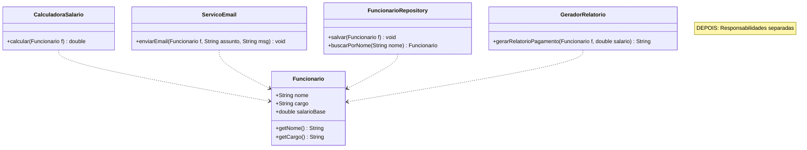

# Diagramas UML do Projeto

Este documento contém diagramas UML ilustrando os conceitos do projeto usando **Mermaid**, além de um tutorial completo sobre UML.

---

# Tutorial de UML - Unified Modeling Language

## O que é UML?

**UML (Unified Modeling Language)** é uma linguagem visual para modelagem de sistemas orientados a objetos. Foi criada para padronizar a representação de diagramas de software, facilitando a comunicação entre desenvolvedores, analistas e stakeholders.

### História
- **1994-1996:** Criada por Grady Booch, James Rumbaugh e Ivar Jacobson (os "Três Amigos") na Rational Software
- **1997:** Adotada pela OMG (Object Management Group) como padrão
- **2005:** Reconhecida pela ISO como padrão internacional

### Por que usar UML?

1. **Comunicação visual:** Diagramas são mais fáceis de entender que código
2. **Documentação:** Documenta a arquitetura e design do sistema
3. **Planejamento:** Ajuda a visualizar o sistema antes de implementar
4. **Padrão:** Linguagem universal entendida por desenvolvedores worldwide

---

## Tipos de Diagramas UML

A UML 2.5 define **14 tipos de diagramas**, divididos em duas categorias:

### 1. Diagramas Estruturais (Estáticos)
Mostram a estrutura estática do sistema:

| Diagrama | Descrição |
|----------|-----------|
| **Classe** | Estrutura das classes, atributos, métodos e relacionamentos |
| **Objeto** | Instâncias de classes em um momento específico |
| **Componente** | Organização de componentes de software |
| **Implantação** | Hardware e distribuição física do sistema |
| **Pacote** | Organização de elementos em pacotes/namespaces |
| **Estrutura Composta** | Estrutura interna de classes complexas |
| **Perfil** | Extensões da UML para domínios específicos |

### 2. Diagramas Comportamentais (Dinâmicos)
Mostram o comportamento e interação do sistema:

| Diagrama | Descrição |
|----------|-----------|
| **Caso de Uso** | Funcionalidades do sistema do ponto de vista do usuário |
| **Sequência** | Interação entre objetos ao longo do tempo |
| **Comunicação** | Interação entre objetos (foco nas mensagens) |
| **Estado** | Estados e transições de um objeto |
| **Atividade** | Fluxo de atividades e processos |
| **Tempo** | Restrições temporais entre eventos |
| **Visão Geral de Interação** | Visão geral de fluxos de controle |

---

## Diagrama de Classes (Class Diagram)

O diagrama de classes é o **mais utilizado** em UML. Representa a estrutura estática do sistema mostrando classes, seus atributos, métodos e relacionamentos.

### Elementos Básicos

#### 1. Classe
```
+------------------+
|   NomeDaClasse   |  <-- Nome (obrigatório)
+------------------+
| - atributo1      |  <-- Atributos
| + atributo2      |
+------------------+
| + metodo1()      |  <-- Métodos
| - metodo2()      |
+------------------+
```

**Notação de Visibilidade:**
- `+` Público (public)
- `-` Privado (private)
- `#` Protegido (protected)
- `~` Package/default

**Exemplo em Mermaid:**


#### 2. Interface
Representada com o estereótipo `<<interface>>`:


#### 3. Classe Abstrata
Representada com o estereótipo `<<abstract>>` ou nome em itálico:


### Relacionamentos

#### 1. Herança (Generalização)
Relação "é um" - classe filha herda da classe pai.


**Sintaxe:** `ClassePai <|-- ClasseFilha`

#### 2. Implementação
Classe concreta implementa uma interface.


**Sintaxe:** `Interface <|.. ClasseImplementadora`

#### 3. Associação
Relação "tem um" ou "usa um" entre classes.


**Sintaxe:** `ClasseA --> ClasseB`

#### 4. Agregação
Relação "tem um" fraca - parte pode existir independentemente.


**Sintaxe:** `ClasseTodo o-- ClasseParte`

**Características:**
- Parte pode existir sem o todo
- Representada por losango vazio

#### 5. Composição
Relação "tem um" forte - parte não existe sem o todo.


**Sintaxe:** `ClasseTodo *-- ClasseParte`

**Características:**
- Parte é destruída com o todo
- Representada por losango preenchido

#### 6. Dependência
Relação de uso temporário.


**Sintaxe:** `ClasseA ..> ClasseB : usa`

### Multiplicidade

Indica quantas instâncias estão envolvidas no relacionamento:

| Notação | Significado |
|---------|-------------|
| `1` | Exatamente um |
| `0..1` | Zero ou um |
| `*` | Zero ou muitos |
| `1..*` | Um ou muitos |
| `n` | Exatamente n |
| `n..m` | De n a m |

**Exemplo:**


---

## Outros Diagramas Importantes

### Diagrama de Sequência
Mostra interação entre objetos ao longo do tempo.


### Diagrama de Caso de Uso
Mostra funcionalidades do sistema do ponto de vista do usuário.

```mermaid
usecaseDiagram
    actor Cliente
    actor Administrador
    
    package "Sistema de Vendas" {
        usecase "Realizar Compra"
        usecase "Consultar Produtos"
        usecase "Gerenciar Estoque"
        usecase "Gerar Relatórios"
    }
    
    Cliente --> "Realizar Compra"
    Cliente --> "Consultar Produtos"
    Administrador --> "Gerenciar Estoque"
    Administrador --> "Gerar Relatórios"
```

### Diagrama de Estado
Mostra estados e transições de um objeto.


### Diagrama de Atividade
Mostra fluxo de atividades e decisões.


---

## Boas Práticas com UML

### 1. Nomenclatura
- Use nomes significativos e em português ou inglês (seja consistente)
- Classes: substantivos (Cliente, Pedido, Produto)
- Métodos: verbos ou frases verbais (calcularTotal, enviarEmail)
- Interfaces: adjetivos ou substantivos (Pagamento, Comparable)

### 2. Níveis de Detalhe
- **Visão Geral:** Mostre apenas classes principais
- **Detalhado:** Inclua todos atributos e métodos
- **Escolha o nível adequado** ao público-alvo

### 3. Organização
- Agrupe classes relacionadas em pacotes
- Evite diagramas muito grandes (divida em múltiplos)
- Use cores para destacar diferentes tipos de elementos

### 4. Manutenção
- Mantenha diagramas sincronizados com o código
- Versione seus diagramas junto com o código
- Use ferramentas que geram código a partir de UML (e vice-versa)

---

## Ferramentas para UML

### Gratuitas
- **Mermaid:** Sintaxe textual, integra com Markdown
- **PlantUML:** Sintaxe textual, muito completo
- **Draw.io (diagrams.net):** Interface visual, online e desktop
- **StarUML:** Desktop, muito popular

### Pagas
- **Enterprise Architect:** Completo, industrial
- **Visual Paradigm:** Muitos recursos, boa curva de aprendizado
- **IBM Rational Rose:** Clássico, muito usado em grandes empresas

---

## Sumário

1. [Os 4 Pilares da OOP](#os-4-pilares-da-oop)
2. [Princípios SOLID](#princípios-solid)
3. [Composição vs Herança](#composição-vs-herança)
4. [Tratamento de Exceções](#tratamento-de-exceções)
5. [Generics](#generics)

---

## Os 4 Pilares da OOP

### 1. Encapsulamento


**Conceito:** Ocultar detalhes internos, expor apenas o necessário através de interface pública.

---

### 2. Herança


**Conceito:** Especialização de classes através do relacionamento "é um".

---

### 3. Polimorfismo


**Conceito:** Objetos diferentes respondem ao mesmo método de formas distintas.

---

### 4. Abstração


**Conceito:** Modelar apenas o essencial, esconder complexidades de implementação.

---

## Princípios SOLID

### 1. SRP - Single Responsibility Principle




---

### 2. OCP - Open/Closed Principle

```mermaid
classDiagram
    note "ANTES: Modificar para adicionar tipos"
    
    class ProcessadorPagamentoErrado {
        +processar(String tipo, double valor) void
    }
    note for ProcessadorPagamentoErrado "if (tipo.equals("CARTAO")) ...\\nelse if (tipo.equals("BOLETO")) ..."
```

```mermaid
classDiagram
    note "DEPOIS: Extender sem modificar"
    
    class MetodoPagamento {
        <<interface>>
        +processar(double valor) void
        +getDescricao() String
    }
    
    class PagamentoCartaoCredito {
        +processar(double valor) void
    }
    
    class PagamentoBoleto {
        +processar(double valor) void
    }
    
    class PagamentoPix {
        +processar(double valor) void
    }
    
    class PagamentoCripto {
        +processar(double valor) void
    }
    
    class ProcessadorPagamento {
        +processar(MetodoPagamento metodo, double valor) void
    }
    
    MetodoPagamento <|.. PagamentoCartaoCredito
    MetodoPagamento <|.. PagamentoBoleto
    MetodoPagamento <|.. PagamentoPix
    MetodoPagamento <|.. PagamentoCripto
    ProcessadorPagamento ..> MetodoPagamento
    
    note for PagamentoCripto "Nova classe sem\\nmodificar código existente"
```

---

### 3. LSP - Liskov Substitution Principle

```mermaid
classDiagram
    note "ANTES: Subclasse quebra contrato"
    
    class RetanguloErrado {
        #double largura
        #double altura
        +setLargura(double l) void
        +setAltura(double a) void
    }
    
    class QuadradoErrado {
        +setLargura(double l) void
        +setAltura(double a) void
    }
    
    RetanguloErrado <|-- QuadradoErrado
    note for QuadradoErrado "Quebra contrato:\nsetLargura() altera altura!"
```

```mermaid
classDiagram
    note "DEPOIS: Respeito ao contrato"
    
    class FormaGeometrica {
        <<interface>>
        +calcularArea() double
        +calcularPerimetro() double
    }
    
    class Retangulo {
        -double largura
        -double altura
        +calcularArea() double
        +calcularPerimetro() double
    }
    
    class Quadrado {
        -double lado
        +calcularArea() double
        +calcularPerimetro() double
    }
    
    class Circulo {
        -double raio
        +calcularArea() double
        +calcularPerimetro() double
    }
    
    FormaGeometrica <|.. Retangulo
    FormaGeometrica <|.. Quadrado
    FormaGeometrica <|.. Circulo
    
    class FolhaPagamento {
        +calcularTotal(Funcionario[] funcs) double
    }
    
    note for FormaGeometrica "Contrato claro"
    note for FolhaPagamento "Funciona com QUALQUER Funcionario"
```

---

### 4. ISP - Interface Segregation Principle

```mermaid
classDiagram
    note "ANTES: Interface gorda"
    
    class TrabalhadorErrado {
        <<interface>>
        +trabalhar() void
        +comer() void
        +dormir() void
        +programar() void
        +atenderCliente() void
    }
    
    class RoboErrado {
        +trabalhar() void
        +comer() void
        +dormir() void
    }
    
    note for RoboErrado "Obrigado a implementar\\ncomer() e dormir() -\\nlança exceção!"
```

```mermaid
classDiagram
    note "DEPOIS: Interfaces pequenas e específicas"
    
    class Trabalhador {
        <<interface>>
        +trabalhar() void
    }
    
    class SerVivo {
        <<interface>>
        +comer() void
        +dormir() void
    }
    
    class Programador {
        <<interface>>
        +programar() void
        +revisarCodigo() void
    }
    
    class Atendente {
        <<interface>>
        +atenderCliente() void
        +resolverProblema(String p) void
    }
    
    class Desenvolvedor {
        +trabalhar() void
        +comer() void
        +dormir() void
        +programar() void
        +revisarCodigo() void
    }
    
    class Robo {
        +trabalhar() void
    }
    
    class AtendenteCliente {
        +trabalhar() void
        +comer() void
        +dormir() void
        +atenderCliente() void
    }
    
    Trabalhador <|.. Desenvolvedor
    SerVivo <|.. Desenvolvedor
    Programador <|.. Desenvolvedor
    
    Trabalhador <|.. Robo
    
    Trabalhador <|.. AtendenteCliente
    SerVivo <|.. AtendenteCliente
    Atendente <|.. AtendenteCliente
    
    note for Robo "Implementa apenas o que precisa"
```

---

### 5. DIP - Dependency Inversion Principle

```mermaid
classDiagram
    note "ANTES: Alto acoplamento"
    
    class ServicoUsuarioErrado {
        -MySQLDatabase database
        +ServicoUsuarioErrado()
        +salvarUsuario(String nome) void
    }
    
    class MySQLDatabase {
        +connect() void
        +query(String sql) void
        +close() void
    }
    
    ServicoUsuarioErrado ..> MySQLDatabase : depende diretamente
    note for ServicoUsuarioErrado "Cria MySQLDatabase dentro\\nDifícil testar, trocar BD"
```

```mermaid
classDiagram
    note "DEPOIS: Depende de abstração"
    
    class Database {
        <<interface>>
        +connect() void
        +query(String sql) void
        +close() void
    }
    
    class MySQLDatabaseImpl {
        +connect() void
        +query(String sql) void
        +close() void
    }
    
    class PostgreSQLDatabaseImpl {
        +connect() void
        +query(String sql) void
        +close() void
    }
    
    class InMemoryDatabase {
        +connect() void
        +query(String sql) void
        +close() void
    }
    
    class ServicoUsuario {
        -Database database
        +ServicoUsuario(Database db)
        +salvarUsuario(String nome) void
    }
    
    Database <|.. MySQLDatabaseImpl
    Database <|.. PostgreSQLDatabaseImpl
    Database <|.. InMemoryDatabase
    ServicoUsuario ..> Database : depende da abstração
    
    note for ServicoUsuario "Recebe Database via construtor\\nFácil testar com InMemoryDatabase"
```

---

## Composição vs Herança

### Composição

```mermaid
classDiagram
    class EstrategiaMovimento {
        <<interface>>
        +mover(String modelo) void
    }
    
    class MovimentoTerrestre {
        +int rodas
        +String terreno
        +mover(String modelo) void
    }
    
    class MovimentoAquatico {
        +double calado
        +String tipoCasco
        +mover(String modelo) void
    }
    
    class MovimentoAereo {
        +double altitudeMaxima
        +String tipoAsa
        +mover(String modelo) void
    }
    
    class Veiculo {
        -String modelo
        -List~EstrategiaMovimento~ estrategias
        +adicionarEstrategia(EstrategiaMovimento e) void
        +removerEstrategia(EstrategiaMovimento e) void
        +mover() void
    }
    
    EstrategiaMovimento <|.. MovimentoTerrestre
    EstrategiaMovimento <|.. MovimentoAquatico
    EstrategiaMovimento <|.. MovimentoAereo
    Veiculo o-- EstrategiaMovimento : "tem muitas"
    
    note for Veiculo "Pode ter múltiplas estratégias:\n- Apenas Terrestre (Carro)\n- Terrestre + Aquático (Anfíbio)\n- Todas (Veículo Voador)"
    note for Veiculo "Pode trocar estratégias em runtime!"
```

---

## Tratamento de Exceções

```mermaid
classDiagram
    class Throwable {
        +getMessage() String
        +printStackTrace() void
    }
    
    class Error {
        <<abstract>>
        OutOfMemoryError
        StackOverflowError
    }
    
    class Exception {
        <<abstract>>
    }
    
    class RuntimeException {
        <<abstract>>
        NullPointerException
        IllegalArgumentException
    }
    
    class CheckedException {
        <<abstract>>
        IOException
        SQLException
    }
    
    class ContaNaoEncontradaException {
        -String numeroConta
        +getNumeroConta() String
    }
    
    class ValorInvalidoException {
        -double valor
        -double minimo
        -double maximo
    }
    
    Throwable <|-- Error
    Throwable <|-- Exception
    Exception <|-- RuntimeException
    Exception <|-- CheckedException
    CheckedException <|-- ContaNaoEncontradaException
    RuntimeException <|-- ValorInvalidoException
    
    note for Error "Não devem ser capturadas\\nProblemas graves do sistema"
    note for RuntimeException "Unchecked - não obrigatórias\\nBugs de programação"
    note for CheckedException "Checked - obrigatórias\\nCondições recuperáveis"
```

---

## Generics

```mermaid
classDiagram
    class Caixa~T~ {
        -T conteudo
        +guardar(T item) void
        +retirar() T
        +estaVazia() boolean
    }
    
    class NumberBox~T extends Number~ {
        -T numero
        +set(T numero) void
        +get() T
        +doubleValue() double
    }
    
    class Repositorio~T, ID~ {
        <<interface>>
        +salvar(T entidade) T
        +buscarPorId(ID id) T
        +buscarTodos() List~T~
        +deletar(ID id) void
    }
    
    class Usuario {
        +Long id
        +String nome
    }
    
    class UsuarioRepository {
        +salvar(Usuario u) Usuario
        +buscarPorId(Long id) Usuario
    }
    
    Caixa~T~ ..> String : Caixa~String~
    Caixa~T~ ..> Integer : Caixa~Integer~
    NumberBox~T~ ..> Integer : NumberBox~Integer~
    NumberBox~T~ ..> Double : NumberBox~Double~
    Repositorio~T,ID~ <|.. UsuarioRepository
    UsuarioRepository ..> Usuario
    
    note for Caixa~T~ "Type parameter T\\nPode ser qualquer tipo"
    note for NumberBox~T~ "Bounded type\\nT extends Number"
```

---

## Legenda Completa

### Elementos

| Notação | Significado | Exemplo |
|---------|------------|---------|
| `class` | Classe | `class Cliente` |
| `<<interface>>` | Interface | `interface Pagamento` |
| `<<abstract>>` | Classe abstrata | `class Forma` |
| `+` | Público (public) | `+metodo()` |
| `-` | Privado (private) | `-atributo` |
| `#` | Protegido (protected) | `#metodo()` |
| `~` | Package/default | `~atributo` |

### Relacionamentos

| Notação | Nome | Significado | Exemplo |
|---------|------|-------------|---------|
| `<\|--` | Herança | "é um" - classe filha herda pai | `Animal <|-- Cachorro` |
| `<\|..` | Realização | Implementa interface | `Pagamento <|.. CartaoCredito` |
| `-->` | Associação | "tem um" ou "usa" | `Cliente --> Pedido` |
| `o--` | Agregação | "tem um" fraco - parte existe sem todo | `Empresa o-- Departamento` |
| `*--` | Composição | "tem um" forte - parte morre com todo | `Carro *-- Motor` |
| `..>` | Dependência | Usa temporariamente | `Relatorio ..> PDFGenerator` |

### Cardinalidade (Multiplicidade)

| Notação | Significado |
|---------|------------|
| `1` | Exatamente um |
| `0..1` | Zero ou um (opcional) |
| `*` | Zero ou muitos |
| `1..*` | Um ou muitos |
| `n` | Exatamente n |
| `n..m` | De n até m |

### Genéricos

| Notação | Significado | Exemplo |
|---------|------------|---------|
| `~T~` | Type parameter | `Caixa~T~` |
| `~T extends Number~` | Bounded type | `NumberBox~T extends Number~` |
| `~T, ID~` | Múltiplos parâmetros | `Repositorio~T, ID~` |

---

## Como Visualizar

Estes diagramas usam a sintaxe **Mermaid** e podem ser visualizados em:

- **GitHub:** Renderização automática em arquivos `.md`
- **VS Code:** Com extensão "Markdown Preview Mermaid Support"
- **IntelliJ:** Com plugin "Mermaid"
- **Online:** [Mermaid Live Editor](https://mermaid.live)

Para exportar como imagem:
1. Acesse [Mermaid Live Editor](https://mermaid.live)
2. Cole o código do diagrama
3. Exporte como PNG/SVG/PDF
